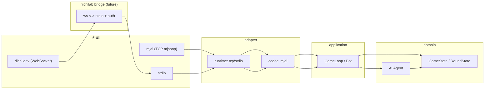

# mjai-manue-go 設計書 (Draft)

対象: `mjai-manue-go` (CoffeeScript版 `mjai-manue` の Go rewrite)

## 1. 背景

### 1.1 参照資料

- `.agents/README.md`: .agents 配下の文書の役割と分割方針。
- `.agents/board-state-output.md`: 盤面状態出力の実装状況と Ruby 版 `mjai` の参照抜粋。
- `.agents/manue-ai-original-spec.md`: CoffeeScript 版 Manue AI ロジックの原仕様。
- `.agents/manue-ai-porting-spec.md`: Manue AI を Go へ移植するための責務分割と接続仕様。
- `.agents/manue-ai-porting-plan.md`: Manue AI 再実装の作業順。
- `.agents/terminology-en.md`: CoffeeScript 版 `mjai-manue` 由来の英語用語集。

- 本プロジェクトは https://github.com/gimite/mjai-manue (CoffeeScript版) を Go に移植する。
- 設計・開発では Eric Evans / Vaughn Vernon の DDD の考え方と、t-wada の TDD を取り入れる。
- 利用形態は CLI。
- 外部通信は以下をサポート対象とする。
  - mjai オリジナルプロトコル (TCP: `mjsonp://...`)（`mjai-tsumogiri` で実装済み）
  - stdio（`mjai-tsumogiri` で実装済み）
  - RiichiLab リニューアル後プロトコル (https://riichi.dev/docs/protocol) は将来の bridge コマンドで対応（WebSocket ↔ stdio 変換 + token 付与）
- 実装済み mjai メッセージ仕様は adapter codec とその単体テストで固定する。

## 2. ゴール / 非ゴール

### 2.1 ゴール (機能)

- **移植のゴール精度**: CoffeeScript版と「同一入力 → 同一出力」を目指す。
  - ただし乱数生成の差は許容する。オリジナルは固定 seed を使うが、Go 移植では Go stdlib の PCG を使うため乱数列は一致しない。
- mjai サーバの固定ルール: **天鳳四人東南喰赤**（固定。ルール切替はしない）。
- バイナリは別コマンド:
  - `mjai-tsumogiri`: 実装済みのモック / 最小AI（常にツモ切り）
  - `mjai-manue`: 本体（CoffeeScript版ロジック移植対象。CLI と周辺配線は整備済みだが、Manue 固有 AI ロジックは再実装対象）

### 2.2 非ゴール (今回の設計範囲外)

- `tools/` 配下の各種統計生成ツールの設計・実装詳細
- `test/` 配下の original-vs-port 比較フレームワークの設計・運用詳細（必要時にのみ実行する想定）

### 2.3 公開 README の扱い

`README.md` / `cmd/README.md` / `cmd/mjai-manue/README.md` は、将来の完成形を先行して示す利用者向けドキュメントとして扱う。
そのため、現時点で `mjai-manue` 本体が未実装でも、README を逐次実装状況へ同期する作業は原則として行わない。
コーディングエージェントが現状実装を判断する場合は、本設計書の「現状コードの把握」「実装計画」と実ファイルを一次情報とし、README の完成形記述だけを根拠に実装済みと判断しない。

## 3. 品質特性 (NFR)

- **堅牢性**: 入力が空行・不正 JSON の場合はエラー終了する（継続しない）。
- **I/O 安全性**: stdout はプロトコル出力に使うため、ログやエラーは stderr に出す。
- **決定性**: 乱数を使うコマンドは `--seed` 未指定時もデフォルト seed `0` で決定的にし、`--seed` 指定時はその seed で再現性を担保する。同一プロセスで複数ゲームを処理する場合も、各 `start_game` で Agent の乱数状態を同じ seed へリセットする。現行 `mjai-tsumogiri` は乱数を使わない。
- **透過性**: 送信はメッセージ単位で必ず flush する。

## 4. アーキテクチャ方針 (DDD + Clean/Hexagonal)

### 4.1 依存方向

依存は内側へ向ける（外側が内側に依存する）。

- `domain` は純粋なビジネスルール（麻雀状態/判定/意思決定の核）。I/O や外部仕様に依存しない。
- `application` はユースケース（入力を処理し、必要なら `domain` を呼び出して結果を返す）。
- `adapter` は外部通信や具体的な I/O 実装（mjai TCP/stdio runtime、JSON コーデックなど）。
- `cmd` は CLI のエントリポイント。フラグ解析、Agent 選択、runtime 起動、終了コード変換のみ。

### 4.2 コンテキスト境界

プロトコル差分をドメインに漏らさないため、外部プロトコルは Anti-Corruption Layer (ACL) で吸収する。



## 5. 現状コードの把握 (参考)

現状のリポジトリには以下が存在する（2026-04-30 時点）。

- `internal/domain/game/` に麻雀の基礎ドメイン（牌、風、席、対局点数、局、手牌、河、副露、役/和了/点数/聴牌/向聴など）が実装され、単体テストも存在する。
- `round.State` は `start_kyoku` から局状態を生成し、`tsumo` / `dahai` / `reach` / `reach_accepted` / 副露・カン / `dora` / 和了（domain `Win`）/ 流局（domain `DrawRound`）の適用を実装している。`dora` はカン後のドラ表示牌 reveal としてのみ有効で、明槓（大明槓/加槓）のカンドラ reveal はルール/牌譜差分を吸収するため嶺上牌の前後どちらでも受け入れる。暗槓は reveal 後に嶺上牌を受け入れ、連続カンで明槓由来の reveal が遅延している場合は暗槓後に未開示分をまとめて reveal してから嶺上牌を受け入れる。`Win` は自摸和了タイミング（和了者がツモ牌を持つ状態）とロン和了タイミング（放銃者の河の末尾が和了牌の状態）を有効として扱い、ロンではフリテンを不正として扱う。visible player は実手牌の待ちが河または `extraSafeTiles` と交差する場合に `IsFuriten` を更新し、invisible player は和了牌が河または `extraSafeTiles` と交差する場合にロンフリテンとして扱う。他家の打牌や加槓牌は、その牌へのロンを見送って次の非 `Win` イベントへ進んだ時点で `extraSafeTiles` に追加する。`seat.Seat.DistanceFrom(base)` は seat の相対位置（同席/下家/対面/上家）を `0..3` で返す。`DrawRound` はチョンボ等にも使う想定で任意タイミングの適用を許容する。`end_kyoku` は `application.Bot` 側で局終了として扱い、`round.State.Apply` には渡さない。
- `round.State.RenderBoard()` は Ruby 版 `mjai` の `Game.render_board()` 相当の最小フォーマットを pure method として実装済み。runtime から stderr に出力できる。
- `internal/adapter/mjai/inbound/` に、mjai メッセージ（JSON）を decode する codec と単体テストが存在する。現状の decode 対応は `hello` / `start_game` / `end_game` / `error` / `start_kyoku` / `tsumo` / `dahai` / `reach` / `reach_accepted` / `pon` / `chi` / `ankan` / `kakan` / `daiminkan` / `dora` / `hora` / `ryukyoku` / `end_kyoku`。
- `inbound.ParseEvent` が domain event へ変換するのは `start_kyoku` / `tsumo` / `dahai` / `reach` / `reach_accepted` / `pon` / `chi` / `ankan` / `kakan` / `daiminkan` / `dora` / `hora` / `ryukyoku` / `end_kyoku`。mjai の `hora` は domain `Win`、`ryukyoku` は domain `DrawRound` へ変換する。`possible_actions` は decode・意思決定ともに使わない。
- `internal/adapter/mjai/outbound/` に、`join` / 同期応答用 `none` / 明示見送り用 `pass`（wire type は `none`）/ `dahai` の outbound codec と単体テストが存在する。domain action からの変換は `Pass` → `pass`、`Discard` → `dahai`。
- `internal/adapter/mjai/runtime/` に、stdio / mjsonp TCP client の runtime loop と、transport 間で共有する mjai `Driver` が存在する。`Driver` は `hello` で `join`、`start_game` で Bot 生成、`end_game` で終了状態、通常メッセージで event 適用と action 変換を行う。
- `internal/application/` に Bot と入力への反応（`NoReaction` / `Action`）が実装されている。現状の action 判定は `round.State.LegalActions(selfID)` が空かどうかを参照する。`LegalActions` は自摸後・副露後など `pendingDiscard` が立つ局面の打牌候補、自摸和了、ロン、ポン、チー、大明槓、見送り候補まで実装済み。Agent へ渡す観測は `round.ActionStateViewer` として、局面 view と合法手一覧の両方を含む。
- `internal/domain/ai/` に Agent インタフェースとツモ切り Agent が実装されている。ツモ切り Agent は drawn tile がある場合に `Discard(tsumogiri=true)`、ない場合に `Pass` を返す。
- `cmd/mjai-tsumogiri/` に、stdio / mjsonp TCP client を切り替えて最小AIを起動する `package main` 実装が存在する。現状の共通フラグは `--name` / `--id` で、`--seed` はない。
- `cmd/mjai-manue/` は CLI と runtime 配線を持つ。`--name` / `--id` / `--seed` / stdio / mjsonp TCP client、stats / danger tree の load、Agent 生成動線は整備済み。ただし `internal/domain/ai` の Manue 固有ロジックは途中実装に引っ張られた構造が残っているため、CoffeeScript 版の原仕様化と Go 移植仕様化を先に行ったうえで再実装する。
- `configs/` は JSON を build 時 embed して読み出す実装がある（`encoding/json/v2` 前提）。

本設計書は、上記の既存資産を活用し、`mjai-manue` の Manue 固有 AI ロジックと RiichiLab bridge を段階的に足していく前提で進める。

## 6. ユースケース

### 6.1 Bot (共通)

入力（外部メッセージ）を逐次処理して内部状態を更新し、意思決定要求が来たら AI に問い合わせ、外部へアクションを返す。
Bot は `start_game` 相当の開始通知で確定する自身の席 ID を受け取ってから生成する。この生成は `internal/adapter/mjai/runtime` の protocol adapter / transport loop 側で行い、Bot 自体は開始後の domain event 処理に集中する。神視点の牌譜解析など `start_game.id` が欠落する入力では CLI の `--id` で指定された fallback ID を使い、`start_game.id` が存在する場合は transport に関係なくメッセージ側の ID を優先する。
ここでの「アクションを返す」は、全入力に対して必ず出力するという意味ではない。application の処理結果（Reaction）は、少なくとも以下を区別する。

- `NoReaction`: 状態更新のみで、エージェントとして返すべき意思決定がない。
- `Action`: 打牌、立直、副露、和了、見送り（`Pass`）など、エージェントが選択した行動。

mjai プロトコル上の `{"type":"none"}` は、行動機会がない入力への同期応答にも、副露・和了などを明示的に見送る行動にも使われる。そのため、内部表現では `NoReaction` と `Pass` を必ず区別する。`Pass` は actor を持つ合法手集合の action であり、`NoReaction` は action ではない。
さらに mjai-manue の出力 JSON には任意の `log` フィールドを付与できるため、wire 上も同期応答用 `none` と明示見送り用 `pass` を outbound codec の型で分離する。`NoReaction` は application の処理結果であり、mjsonp adapter が同期応答として生成する `none` は `{"type":"none"}` のみを送信し、AI の意思決定ログを持たせない。一方、`Pass` は Agent が選んだ action なので、actor と必要なら `log` を付けて `{"type":"none","actor":0,"log":"..."}` として送信できる。

1. transport から 1メッセージ受信
2. codec（`inbound`）で「プロトコル固有メッセージ」を decode する
3. `start_game` の場合、mjai runtime `Driver` が `id` から Bot を生成する。`id` が欠落していれば CLI fallback ID を使う
4. 局進行メッセージの場合、codec が domain event へ変換し、Bot が domain state に適用（状態更新）する
5. 状態更新後に `LegalActions(selfID)` で **合法手（集合）**を取得する。空なら返すべき action はない。
6. 合法手があるなら、局面 view と合法手一覧を含む obs（`ActionStateViewer`）を AI Agent に渡す。
7. AI Agent が obs の合法手の中から Action を選択する（評価値は合法手列挙に含めない）
8. codec（`outbound`）で「内部アクション → プロトコル固有メッセージ」へ変換
9. action がある場合は transport で送信（flush）。`NoReaction` の扱いは adapter ごとに決める。

現状実装では 5〜7 は `LegalActions(selfID)` を入口にしており、自摸後の打牌/リーチ/自摸和了、他家打牌後のロン/ポン/チー/大明槓/見送りを列挙する。複数 actor の同時行動機会は、必要に応じて各 playerID の `LegalActions(playerID)` を問い合わせて判定する。

stdio と mjsonp TCP client は mjai message の意味解釈を共有するため、`Driver` を共通部として使う。transport loop は `Driver` が返した outbound message を送信する。`Driver` が outbound message を返さなかった場合、stdio は何も出力せず、mjsonp TCP client は mjai の同期応答として `{"type":"none"}` を返す。

## 7. CLI 設計

### 7.1 共通フラグ

- `--name <PLAYER_NAME>`: プレイヤー名
- `--id <ID>`: `start_game.id` 欠落時に使う自分の fallback 席 ID（デフォルト `0`）
- `[<URL>]`: 接続先 URL（省略時は stdio）

現状実装済みの `mjai-tsumogiri` は乱数を使わないため `--seed` を持たない。`mjai-manue` は `--seed <INT>` を持ち、未指定時はデフォルト seed `0` とする。

`--id` は、神視点の牌譜など `start_game.id` が欠落する JSON Lines 入力を解析するための fallback である。stdio でもシミュレーター接続などで `start_game.id` が届く場合があり、その場合は `--id` ではなくメッセージ側の ID を使う。複数ゲームを同一プロセスで処理する場合も、id ありゲームの ID を次の id 欠落ゲームへ持ち越さず、毎回 CLI fallback ID に戻す。

### 7.2 モード判定（優先順位）

1. URL 引数あり → mjsonp TCP client（`mjsonp://...` のみ許容）
2. それ以外 → stdio

### 7.3 終了コード（一般的な分類）

- `0`: 正常終了（例: stdio は EOF、mjsonp TCP client は接続クローズ。mjsonp TCP client は CoffeeScript 版同様、`end_game` 前の接続クローズも正常終了として扱う）
- `1`: 実行時エラー（I/O、プロトコル違反、JSON 不正等）
- `2`: CLI 利用エラー（フラグ不足/不正、URL スキーム不正等）
- `130`: ユーザー割り込み（SIGINT 等。OS により変わる可能性あり）

※ mjsonp TCP client は「切断時は即終了」とし、CoffeeScript 版に合わせて `end_game` 観測前の EOF もエラー扱いしない。

### 7.4 エラー出力

- stderr に出す（複数行可、固定 prefix 不要）。
- stdout はプロトコル出力専用。

## 8. 外部通信 (Ports & Adapters)

### 8.1 共通仕様

- stdio / mjsonp TCP client は **1行 1 JSON**。
  - 入力の改行は `\n`/`\r\n` を許容。
  - 空行はエラー終了（exit `1`）。
  - 不正 JSON はエラー終了（exit `1`）。
- 送信する場合はメッセージ単位で必ず flush。
- stdout は protocol output 専用のため、受信/送信 JSON trace と盤面状態ログは stderr に出す。盤面状態ログは domain の pure な整形メソッドで文字列化し、application の状態更新直後に reporter 経由で出力する。

### 8.2 mjai (mjsonp TCP client: `mjsonp://...`)

- URL 形式は `mjsonp://host:port/room` のみを許容。
- 再接続はしない。
- 切断時は即終了し、`end_game` 観測前の EOF も正常終了として扱う。これは CoffeeScript 版 `TCPClientGame.play()` の close handling に合わせるため。
- `hello` 受領時は protocol / protocol_version を検証しない。他の mjai 互換サーバー実装でも使えるよう、接続後の handshake は `hello` に対して `join` を返すことに集中する。
- `hello` への応答は `join` とし、URL path から得た room を送信する。
- TCP lifecycle log として、`connected` / `closed` / `tcp error: ...` 相当を stderr 側の log writer へ出す。stdout には出さない。
- `error` 受領時は server error として扱い、protocol response を送信せず終了する。CoffeeScript 版は socket close のみだが、Go 版は呼び出し元が失敗を判定できるよう error を返す。
- mjai サーバーは 1 入力に対する 1 応答を期待するため、application が `NoReaction` を返した場合も adapter が `{"type":"none"}` を送信する。
- application が `Pass` action を返した場合も wire type は `none` になるが、`actor` を含めて `{"type":"none","actor":0}` のように送信する。これは「副露・和了等を見送る」という意思決定であり、`NoReaction` とは区別する。
- `end_game` 受領時は protocol response を送信せず正常終了する。`end_game` は Bot へ渡さず、局面ログ等の後処理も実行しない。最終局面のログは直前の `end_kyoku` までに出力する。

### 8.3 stdio

- URL 引数を省略した場合は stdin を入力、stdout を出力とする。
- stdio は JSON Lines の入力を読み進め、application が action を返したタイミングでのみ stdout へ 1 行出力する。
- application が `NoReaction` を返した場合は何も出力せず、次の入力行を読む。
- application が `Pass` action を返した場合は `{"type":"none","actor":0}` のように actor 付きで出力する。これは行動機会に対する明示的な見送りであり、行動機会がないことを表す `NoReaction` ではない。
- `end_game` を受領しても即終了せず、EOF まで入力を読み続ける。これにより子プロセスとして扱う側は stdin close でプロセス寿命を制御できる。
- mjai.app 提出型は廃止したため、提出 zip 生成はスコープ外。

### 8.4 RiichiLab (riichi.dev, WebSocket)

RiichiLab bridge は未実装。実装時は Go 側に bridge コマンド（仮: `cmd/mjai-manue-riichilab`）と `internal/adapter/riichilab` を追加し、以下の方針に従う。

- WebSocket endpoint に接続し、bot token を **Authorization header** に付与する（riichi.dev の記載に従う）。
- WebSocket メッセージを stdio (JSON Lines) に変換して `mjai-manue` / `mjai-tsumogiri` を子プロセスとして起動し、双方向に中継する。
- 再接続はしない。切断時は即終了する。
- 変換の責務（プロトコル差分吸収）は `internal/adapter/riichilab` に集約し、エージェント本体は mjai オリジナル相当の JSON Lines を扱う前提とする。
- **`request_action` は riichi.dev 側の拡張要素**であり、子プロセスのエージェントには転送しない。
  - RiichiLab bridge は `request_action` を「エージェントの出力（action）を riichi.dev に返すタイミング調整」にのみ使用する。
  - エージェント（Go）は入力メッセージで更新された **State を見て**「今返すべき action があるか」を判断する（`request_action` を受信して起動されない）。
  - RiichiLab bridge は必要に応じて、エージェントからの出力をバッファし、`request_action` 受領時に riichi.dev へ送信する。
  - Go 側の stdio 出力は sparse output（action がある時だけ出力）を前提とする。actor 付き `{"type":"none","actor":0}` が出力された場合は、行動機会がない入力への ack ではなく、行動機会に対する `Pass` action として扱う。
- `possible_actions` は **RiichiLab 互換性のため存在しないものとして扱う**（入力に含まれていても無視する）。
  - Go 側は `possible_actions` を信頼しない。
  - 合法手（`LegalActions`）は常に State から算出する（`possible_actions` に依存しない）。

## 9. ドメインモデル (概要)

既存の `internal/domain/game/` を核として利用する。

### 9.1 主要な概念

- **Match（対局）**: 対局全体を通した状態（点数、局の進行、現在の局など）
- **Round（1局）**: 1局内の状態（ドラ表示、残り牌山、プレイヤーの手牌/河/副露など）
  - Round は局ごとに生成され、局終了で破棄される（`Match` が所有する）
- **Player / Hand / Meld** 等の状態（Round 内のエンティティ）
- **Event**: 外部入力を内部イベントへ変換したもの（ドメイン状態更新の入力）
  - `request_action` のような「出力タイミング調整用イベント」は domain に持ち込まない（ブリッジ側/adapter側の責務）
  - event は観測した事実を typed に保持する薄いオブジェクトとし、局面依存の正当性や値オブジェクトと重複する詳細 validation は持たない。
  - JSON の形状・必須フィールド・配列長・牌コード/席番号などのプロトコル入力検証は inbound codec が担い、状態遷移としての正当性は `round.State.Apply` / `round.NewState` / `player` / `meld` などの domain object が担う。
- **Action**: Bot が返すべき行動（打牌、鳴き、立直、見送り等）
  - `Pass`（見送り）は actor を持つ action の一種。mjai outbound では wire type `none` だが、同期応答用 `none` と区別するため `{"type":"none","actor":0}` のように actor を含めて変換される。
  - `NoReaction`（返すべき行動なし）は action ではない。mjsonp adapter では同期応答として `{"type":"none"}` に変換され得るが、domain/application 上は `Pass` と同一視しない。
  - `log` は action の一部ではなく、Agent の判断説明やデバッグ出力として application 層の意思決定結果に付随させる。domain action は「選択された行動」の不変条件に集中し、mjai 固有の `log` フィールドは outbound codec が application から受け取った付加情報として JSON に反映する。

本プロジェクトでは、domain 側の `tile` は mjai の牌コード表現（例: 赤5は `5mr`/`5pr`/`5sr`）をそのまま採用する。
外部プロトコル（例: RiichiLab）側で別表現が必要な場合は、codec 側で変換して domain へ渡す。
また codec は方向（外部→内部 / 内部→外部）で責務が割れるため、`internal/adapter/mjai/inbound`（外部メッセージ → domain event）と `internal/adapter/mjai/outbound`（domain action → 外部メッセージ）に分離する。
inbound 側は最終的に「JSON の `type` を見て domain の `event.Event` へ変換するディスパッチ関数（例: `ParseEvent`）」を提供し、application からは「1メッセージ入力 → 1イベント出力」として扱えるようにする。
ここでの「1メッセージ」は transport がフレーミング（例: JSON Lines の 1行）して `[]byte` として codec に渡すことを想定し、codec 自体は I/O を持たず変換に専念する。

この分離は「event（事実）と action（意図）を同じ構造体で扱わない」ためのものでもある。たとえば `hora` のように、outbound は宣言に近い一方、inbound は結果（点数や精算など）を含み得るため、同一型にすると `omitempty` や `nil` の多用で不変条件が曖昧になり、誤って出してはいけないフィールドを送信する事故が起きやすい。

### 9.2 Aggregate 設計（DDD観点の提案）

#### Aggregate Root

- `Match` を Aggregate Root とし、`Round` をその内部に保持する。
  - 理由: ライフサイクルが「局開始→局終了で破棄」なため、Round 単体を外に晒すより `Match` の責務として管理した方が境界が明確になる。

#### `game.State` / `round.State` の分離

ユーザー構想どおり、**対局全体（Match）と局内（Round）を分離する**のは妥当。

- `game.State`（現状: 対局の点数管理）＝ `Match` 相当
- `round.State`（現状: 局内状態）＝ `Round` 相当

命名はユビキタス言語に合わせ、将来的に `game.State` を `match.State` や `game.Match` といった名前へ寄せることを推奨する（ただし初期は大変更可能なため、今の package 構造のままでもよい）。

### 9.3 EventApplier / legal actions の責務分担（再検討）

#### 結論

- `EventApplier` は「外部イベントを適用して Round/Match を遷移させる」ドメインの中核であり、現状の実装で設計を固定する。
- 現状の実装では `round.State` が `Apply(ev event.Event) error` を持ち、イベント適用の入り口になっている。mjai の局進行イベントは実装済みで、今後イベント種別が増える見込みはない。
- `round.State` は現状を最終形として扱う。カン進行・終局管理・action timing などを小さな struct や service に分割しても、メソッド呼び出しや間接参照が増えて読みやすさを損ねる可能性が高いため、責務分割目的の追加リファクタリングは原則として行わない。
- `request_action` を受け取れない前提（オリジナル mjai 相当）では、エージェントは **State から legal actions を計算**し、さらに「今 action を返すべき局面か」も State から判断する必要がある。
- `possible_actions` は存在しないものとして扱い、意思決定の根拠にしない（RiichiLab 互換性のため）。

#### 推奨インタフェース（案）

Go では read-only を型で保証しづらいので、Agent には「参照用 interface」を渡し、更新は Aggregate のメソッドに閉じ込める。

例（概念）:

```go
// Match は対局全体を管理する Aggregate Root。
type Match interface {
    Apply(ev Event) error // 状態更新
    Viewer() MatchViewer
}

// Round は局内状態（Matchが所有）。
type Round interface {
    Apply(ev Event) error
    LegalActions(playerID ID) ([]Action, error) // 合法手の列挙（集合）。情報不足なら error
    Viewer() RoundViewer
}

type Request struct {
    Actor ID
    Round ActionStateViewer // 局面 view と legal actions を含む観測（obs）
}

type Decision struct {
    Action Action
    Log string
    Trace string
}
```

- `LegalActions` は「行動候補の列挙」であり、**選択（どれを選ぶか）は Agent の責務**。空であることは、その actor に今返すべき action がないことを表す。
- Agent へ渡す obs は局面 view と合法手一覧の両方を含む複合 interface（例: `ActionStateViewer`）とする。
- `ai.Request` の `Round` は AI 分野でいう observation（obs）として扱う。legal actions は Request の別フィールドとして外から渡すのではなく、obs の一部として参照できる形を標準とする。これは強化学習・ゲームAI系の API で、局面観測とその局面で選べる action mask / legal actions を同じ観測側に含める設計が主流であるため。
- チー候補は喰い替え制約を反映する。チー後に残る手牌がすべて喰い替え牌になる場合、そのチーは直後に合法打牌を選べないため `LegalActions` に含めない。
- 将来的に tools で「4人全員の合法手」を観測したい場合、`LegalActions(playerID)` を 0..3 で呼び出せばよい（必要なら `LegalActionsAll()` を追加する）。
- `Pass`（見送り）は **副露・和了が可能な局面に限って** `LegalActions` に含める（常に含めない）。

#### どこで legal actions を計算するか（DDD的な置き場）

- `LegalActions` は `round.State` のメソッドとして維持する。現状以上の複雑化は見込まないため、`LegalActionCalculator` のようなドメインサービスへの切り出しは行わない。
- ただし AI へ渡す viewer は observation（obs）として扱うため、getter が内部 slice を直接公開しないよう、防御コピーなどで状態破壊を防ぐ。

### 9.4 Player 実装の重複整理

`VisiblePlayer` と `InvisiblePlayer` は、河・副露・立直状態・喰い替え・安全牌などの状態と処理が一部重複している。
この重複は削減余地があるが、手牌の可視性による差分が大きいため、継承風の大きな抽象化や過度な分割は避ける。
採用する場合は、共通状態を private struct にまとめる程度の小さい整理に留め、読みやすさとテストの明確さを優先する。

### 9.5 役判定サービスの扱い

`service.CalculateFuHan` と `service.Has1Han` は、現状を移植仕様として完成形と扱う。
内部ロジックの invariant 破壊はバグとして扱うため、外部入力が直接入らない箇所の `panic` は許容する。

## 10. AI (Agent) 設計

### 10.1 Agent インタフェース（案）

- 入力: 現在の game/round state と意思決定要求
- 出力: 選択した Action、任意の JSON `log` 用文字列、任意の stderr trace 用文字列
- JSON `log` 用文字列は domain action に埋め込まず、application 層の Reaction として保持し、adapter の outbound codec に渡す。
- stderr trace 用文字列は評価値一覧など protocol output に混ぜない診断出力として扱う。Agent は `os.Stderr` 等の I/O を直接呼ばず、`Decision.Trace` のような値として返す。application は trace が空でない場合のみ、盤面状態出力と decision trace 出力の両方を扱う `Reporter` に渡し、adapter / runtime が注入された stderr writer へ出力する。
- Agent は `Reset()` と `Decide(request)` を持つ。runtime は `start_game` ごとに `Reset()` を呼び、同一プロセスで複数ゲームを処理しても乱数系列が前ゲームの消費量に依存しないようにする。
- 乱数は Agent が seed から再初期化できる形で保持し、評価ロジックからは `Random` インタフェース（または `*rand.Rand`）として使えるようにしてテスト可能にする。
- Go stdlib の PCG を使い、CLI の `--seed` は PCG の第1 seed に渡す。PCG の第2 seed は `0` 固定とする。
- 現状の `TsumogiriAgent` は乱数を使わないため `Reset()` は no-op とする。

### 10.2 実装フェーズ

1. `mjai-tsumogiri`: 最小AI（常にツモ切り、鳴き/立直はしない等の単純方針）
2. `mjai-manue`: CoffeeScript版のロジックを移植し、入力→出力一致を狙う

現状、`internal/domain/ai/` にはツモ切り Agent と ManueAgent の途中実装が存在する。Manue 固有コードは新規設計で再実装する。既存コードは使える純粋関数が見つかった場合だけ流用し、流用のために設計を曲げない。`agent.go` と `tsumogiri_agent.go` は破棄対象外とする。

`mjai-manue` の CoffeeScript 版ロジック移植では、`reference/repositories/mjai-manue-original/coffee/manue_ai.coffee` をロジックの一次資料とする。原仕様は `.agents/manue-ai-original-spec.md`、Go 移植用の責務分割と接続仕様は `.agents/manue-ai-porting-spec.md`、実装順は `.agents/manue-ai-porting-plan.md` に置く。以前 main ブランチで移植した Go 実装（`reference/repositories/mjai-manue-go-main/internal/ai/`）は補助資料としてのみ参照する。

`cmd/mjai-manue` から Manue 本体を動かすため、stats と danger tree は CLI 側で `configs` から読み込み、`ManueAgent` へ deps として渡す。`internal/domain/ai` は `configs` を直接 import せず、stats / danger tree / estimator は用途別の小さい interface で受け取る。一方で局面 observation は `domain/game` 側の `round.ActionStateViewer` / `round.StateViewer` をそのまま使い、AI package 内に同等の state viewer interface を重複定義しない。

`ManueAgent` の再構築では、完成形と異なる独自評価を増やさない。通常手番、副露反応、危険度、和了推定、流局、他家和了、順位期待値は CoffeeScript 版 `getMetricsInternal` と同じ意味の評価値へ寄せる。既に `domain/game` にあるルール判定（合法手、向聴、役、点数、聴牌、和了形）は再実装しない。trace log の action key、表形式、`goals` 件数、`tenpaiProbs` 出力はオリジナル実装と揃え、内部構造は現行 Go のドメイン語彙へ寄せる。

## 11. 設定ファイル (embed 固定)

- `configs/` にある JSON は build 時に embed する。
- 実行時にパス差し替えはしない（ただし開発中に差し替えたい場合はビルド前に置換）。

## 12. テスト戦略 (TDD)

### 12.1 単体テスト

- `domain` の純粋ロジック（牌/向聴/役/点数等）はテーブル駆動で単体テストする。
- ランダムが絡む場合はデフォルト seed `0`、または `--seed` と同等の seed 固定で決定的にする。
- `encoding/json/v2` を使うテスト（例: `adapter/mjai/inbound` や `configs`）を実行する際は、実験機能のため `GOEXPERIMENT=jsonv2` を有効化する。

### 12.2 ゴールデンテスト（プロトコル入出力）

- 入力は mjai オリジナルと同様に **mjsonp ストリーム**（JSON Lines）を使用する。
- メッセージ種別や必須フィールド等の仕様は adapter codec の単体テストで固定する。
- 期待値は **action のみ**を比較する（`log` や評価値等の細部は比較しない）。
  - 比較単位は「意思決定が必要な局面（エージェントが action を出力した時点）」とする。
- golden fixture は対象 package の `testdata/` 配下に置く。runtime 結合の fixture は `internal/adapter/mjai/runtime/testdata/` を起点とし、入力は `*.input.mjson`、期待 stdout は transport ごとに `*.stdio.golden` / `*.mjsonp.golden` とする。
- stdio と mjsonp TCP は transport としての応答方針が異なるため、runtime golden test では同一入力でも期待 stdout を分ける。stdio は sparse output のため action line のみ、mjsonp TCP は同期応答用 `none` を含む protocol output 全体を比較する。
- stdout の protocol output と stderr の trace / 盤面状態出力は混ぜない。stderr 側を golden 化する場合は、protocol action golden とは別 fixture・別テストとして扱う。
- golden test は、基盤追加時点では最小 fixture に留める。以後は「runtime 仕様を広げる時」と「AI ロジックを移植する時」に、その差分で壊れ得る代表ケースを少数追加する。
  - runtime 仕様では、stdio と mjsonp の差分（`NoReaction`、同期応答用 `none`、actor 付き `Pass`、`end_game` 無応答）や、outbound action 種別（`dahai` / `reach` / `hora` / `pon` / `chi` / 各種 kan / `kyushukyuhai`）を固定する。
  - stdio では `end_game` 後も EOF まで入力を読み続けるため、同一 JSON Lines stream 内で次の `start_game` を受け取り、別 id のゲームにも応答できることを golden test で固定する。
  - AI ロジックでは、`.agents/manue-ai-original-spec.md` の characterization ケース候補を優先して fixture を追加する。例: 打牌評価、リーチ判断、副露判断、和了判断、見送り判断。
  - `mjai-manue` の移植テストは、局面を private field の上書きで無理に作らず、原則として mjai JSON Lines 入力から `round.State` を構築して action golden を比較する。局面の意味を fixture に閉じ込められるため、現行 `round.State` の invariant を壊さずに移植差分を確認できる。
  - ただし、合法手集合の分類や優先順位のように state 構築を必要としない小さい純粋判断は、AI package 内の単体テストで固定する。golden test は「入力列から最終的にどの protocol action が出るか」を見る結合寄りのテスト、単体テストは「同じ合法手集合ならどの action を選ぶか」を見るテストとして役割を分ける。
  - 不正 JSON、空行、開始前 event などのエラー系は golden ではなく通常の単体テストで固定する。
  - 長い半荘ログを大量に golden 化することは避ける。失敗時の原因特定が重くなるため、長大な差分確認は `original-vs-port` 比較に寄せる。

### 12.3 original-vs-port 比較

- CI には組み込まない。
- 必要時のみ、差分の根拠確認として実行する。

### 12.4 riichienv 自己対戦テスト

- ローカル自己対戦は riichi.dev と同じ系統のルールエンジンである `riichienv` を使用する。
- Python / `riichienv` は開発者向けの optional dependency とし、通常の Go ビルドや RiichiLab 接続実行には要求しない。
- 手順の詳細は riichi.dev の local testing ドキュメントを一次情報とし、このリポジトリには起動方法と前提条件のみを記載する。

## 13. 実装計画 (2026-04-30 再計画)

### 13.1 完了済みの土台

- `mjai-tsumogiri` の CLI、stdio / mjsonp TCP client runtime、mjai inbound/outbound codec の最小系は実装済み。
- `application.Bot`、`Reaction`、`domain/ai.Agent`、`TsumogiriAgent` は実装済み。
- `round.State` の開始、`tsumo` / `dahai` / `reach` / `reach_accepted` / 副露・カン / `dora` / 和了（`Win`）/ 流局（`DrawRound`）適用、盤面状態出力は実装中。
- mjai inbound event は、局進行メッセージの domain event 化と `round.State.Apply` の受け入れを実装済み。
- 牌・手牌・副露・向聴・聴牌・和了・役・点数など、`mjai-manue` の判断に使う基礎ドメインサービスは一部実装済み。
- `configs/` の JSON embed と `encoding/json/v2` 前提のテスト運用は実装済み。

### 13.2 優先実装順

1. **現状仕様の整合（完了）**
   - `README.md` / `cmd/README.md` / `cmd/mjai-manue/README.md` は完成形を先行して示すため、未実装状態との逐次同期は行わない。コーディングエージェント向けの実装状況は本設計書と `AGENTS.md` に集約する。
   - `mjai-tsumogiri` の現行仕様（`--name`、URL 省略時 stdio、mjsonp URL 指定時 TCP、stderr trace/盤面出力）を設計書とテストで固定する。

2. **mjai inbound event の拡充（完了）**
   - `reach` / `reach_accepted` / `pon` / `chi` / `ankan` / `kakan` / `daiminkan` / `dora` / `hora` / `ryukyoku` を domain event 化し、`round.State.Apply` で状態遷移に反映する。domain event 名は `hora` を `Win`、`ryukyoku` を `DrawRound` とする。
   - `end_kyoku` / `end_game` のような lifecycle message は application/runtime で扱い、局内状態に不要な情報は domain に持ち込まない。
   - 各 message type は inbound codec の単体テストで固定し、未知 type / 不正 field は error にする。

3. **outbound action の拡充（完了）**
   - domain action と outbound codec に `pass` / `reach` / `hora` / `pon` / `chi` / 各種 kan などを追加する。
   - `none` は同期応答専用（`type` のみ）とし、明示見送りの `Pass` は actor を持つ別 outbound 型として wire type `none` へ変換する。
   - `log` は application の decision metadata として扱い、mjai 固有の JSON field へは outbound codec で反映する。
   - mjsonp runtime は `NoReaction` を同期応答 `none` に変換し、stdio は sparse output のままにする。

4. **Action timing と合法手列挙（完了）**
   - `round.State` もしくは domain service に `LegalActions(playerID)` 相当を追加し、Agent へ渡す obs に局面 view と合法手一覧の両方を含める。
   - 自摸後の打牌/リーチ/ツモ和了、他家打牌後のロン/ポン/チー/カン/見送りを、`possible_actions` に依存せず State から算出する。
   - `application.Bot` は `LegalActions(selfID)` が空でない場合に Agent を呼ぶ。
   - `Pass` は行動機会がある場合だけ合法手に含める。`NoReaction` とは引き続き分離する。

5. **ゴールデンテスト基盤**
   - mjson / JSON Lines 入力から「出力 action のみ」を比較するテスト基盤を追加する。
   - まず `mjai-tsumogiri` で stdio sparse output と mjsonp 同期応答の差を固定する。
   - 盤面出力は protocol output と混ぜず、必要な範囲で stderr 側の golden test を分ける。

6. **Manue AI 再実装前の仕様化（完了）**
   - CoffeeScript 版 `manue_ai.coffee` の原仕様を `.agents/manue-ai-original-spec.md` に記録する。
   - Go 移植用の責務分割と接続仕様を `.agents/manue-ai-porting-spec.md` に記録する。
   - `.agents/manue-ai-porting-plan.md` は実装順だけに縮小する。

7. **CoffeeScript 版ロジックの再移植**
   - `.agents/manue-ai-original-spec.md` と `.agents/manue-ai-porting-spec.md` を一次資料として Manue 固有コードを再実装する。
   - `agent.go` と `tsumogiri_agent.go` は維持し、Manue 固有コードだけを整理対象にする。
   - 候補生成、候補評価、危険度推定、和了推定、流局、他家和了、順位期待値、trace を段階的に接続する。
   - 既存の `shanten` / `tenpai` / `win` / `yaku` / `point` service を再利用し、必要な不足だけを追加する。
   - original-vs-port 比較は CI には入れず、差分調査の補助として使う。

8. **RiichiLab bridge**
   - `mjai-manue` と stdio sparse output が安定した後に実装する。
   - `request_action` は bridge 側の出力タイミング調整に閉じ込め、domain/application へ転送しない。
   - `possible_actions` は入力にあっても信頼せず、合法手は State から算出する。

9. **仕上げ**
   - 完成形として先行している README 群と、実装状況を示す設計書・エージェント向け文書の役割分担を保ったまま、必要な補足だけを更新する。
   - `GOEXPERIMENT=jsonv2` 前提の `go test ./...` を通し、必要に応じて package 単位のテストと benchmark を追加する。
