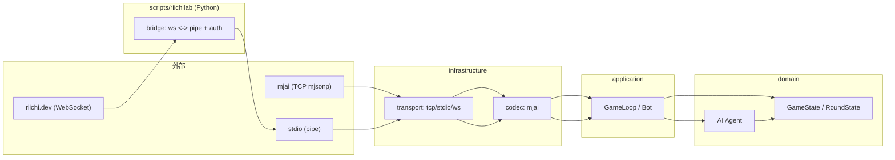

# mjai-manue-go 設計書 (Draft)

作成日: 2026-04-09  
更新日: 2026-04-26  
対象: `mjai-manue-go` (CoffeeScript版 `mjai-manue` の Go rewrite)

## 1. 背景

### 1.1 参照資料

- `docs/protocols.md`: mjai / stdio / RiichiLab 各プロトコルのメッセージ仕様（本リポジトリ内の一次資料）
  - 本設計書では仕様詳細を重複記載せず、必要箇所から参照する。

- 本プロジェクトは https://github.com/gimite/mjai-manue (CoffeeScript版) を Go に移植する。
- 設計・開発では Eric Evans / Vaughn Vernon の DDD の考え方と、t-wada の TDD を取り入れる。
- 利用形態は CLI。
- 外部通信は以下をサポート対象とする。
  - mjai オリジナルプロトコル (TCP: `mjsonp://...`)
  - stdio (pipe)
  - RiichiLab リニューアル後プロトコル (https://riichi.dev/docs/protocol) はブリッジスクリプトで対応（WebSocket ↔ pipe 変換 + token 付与）
- メッセージ仕様の詳細は `docs/protocols.md` に集約する。

## 2. ゴール / 非ゴール

### 2.1 ゴール (機能)

- **移植のゴール精度**: CoffeeScript版と「同一入力 → 同一出力」を目指す。
  - ただし乱数生成の差は許容する（テストのために seed 固定は可能にする）。
- mjai サーバの固定ルール: **天鳳四人東南喰赤**（固定。ルール切替はしない）。
- バイナリは別コマンド:
  - `mjai-manue`: 本体（将来的に CoffeeScript版ロジック移植）
  - `mjai-tsumogiri`: モック / 最小AI（常にツモ切り）

### 2.2 非ゴール (今回の設計範囲外)

- `tools/` 配下の各種統計生成ツールの設計・実装詳細
- `test/` 配下の original-vs-port 比較フレームワークの設計・運用詳細（必要時にのみ実行する想定）

## 3. 品質特性 (NFR)

- **堅牢性**: 入力が空行・不正 JSON の場合はエラー終了する（継続しない）。
- **I/O 安全性**: stdout はプロトコル出力に使うため、ログやエラーは stderr に出す。
- **決定性**: `--seed` 指定時は乱数を決定的にし、ゴールデンテスト等で再現性を担保する。
- **透過性**: 送信はメッセージ単位で必ず flush する。

## 4. アーキテクチャ方針 (DDD + Clean/Hexagonal)

### 4.1 依存方向

依存は内側へ向ける（外側が内側に依存する）。

- `domain` は純粋なビジネスルール（麻雀状態/判定/意思決定の核）。I/O や外部仕様に依存しない。
- `application` はユースケース（入力を処理し、必要なら `domain` を呼び出して結果を返す）。
- `infrastructure` は外部通信や永続化、具体的な I/O 実装（TCP/stdio/WS、JSON コーデックなど）。
- `cmd` は CLI のエントリポイント。フラグ解析、Agent 選択、transport mode 選択、終了コード変換のみ。

### 4.2 コンテキスト境界

プロトコル差分をドメインに漏らさないため、外部プロトコルは Anti-Corruption Layer (ACL) で吸収する。



## 5. 現状コードの把握 (参考)

現状のリポジトリには以下が存在する（2026-04-22 時点）。

- `internal/domain/game/` に麻雀の基礎ドメイン（牌、風、局、手牌、役/和了/向聴など）が実装され、単体テストも存在する。
- `internal/adapter/mjai/inbound/` に、mjai メッセージ（JSON）を domain event へ変換する codec と単体テストが存在する（例: `ParseEvent` / `start_kyoku` / `tsumo` / `dahai`）。
- `internal/adapter/mjai/outbound/` に、`join` と最小 action（`Pass` / 打牌）を mjai メッセージへ変換する codec と単体テストが存在する。
- `internal/adapter/mjai/runtime/` に、stdio/TCP などの transport loop と、transport 間で共有する mjai `Driver`（`hello` / `start_game` / event / action 変換の振り分け）を置く。
- `internal/application/` に、最小 Bot と入力への反応（`NoReaction` / `Action`）が実装されている。
- `internal/domain/ai/` に、Agent インタフェースとツモ切り Agent が実装されている。
- `cmd/` は README のみで、`package main` 実装はまだ無い。
- `configs/` は JSON を build 時 embed して読み出す実装がある（`encoding/json/v2` 前提）。

本設計書は、上記の既存資産を「ドメイン側は活用しつつ、周辺（application/infra/cmd）は作り直せる」前提で進める。

## 6. ユースケース

### 6.1 Bot (共通)

入力（外部メッセージ）を逐次処理して内部状態を更新し、意思決定要求が来たら AI に問い合わせ、外部へアクションを返す。
Bot は `start_game` 相当の開始通知で確定する自身の席 ID を受け取ってから生成する。この生成は `internal/adapter/mjai/runtime` の protocol adapter / transport loop 側で行い、Bot 自体は開始後の domain event 処理に集中する。
ここでの「アクションを返す」は、全入力に対して必ず出力するという意味ではない。application の処理結果（Reaction）は、少なくとも以下を区別する。

- `NoReaction`: 状態更新のみで、エージェントとして返すべき意思決定がない。
- `Action`: 打牌、立直、副露、和了、見送り（`Pass`）など、エージェントが選択した行動。

mjai プロトコル上の `{"type":"none"}` は、行動機会がない入力への同期応答にも、副露・和了などを明示的に見送る行動にも使われる。そのため、内部表現では `NoReaction` と `Pass` を必ず区別する。`Pass` は合法手集合に含まれる action であり、`NoReaction` は action ではない。
さらに mjai-manue の出力 JSON には任意の `log` フィールドを付与できるため、wire format が同じ `{"type":"none"}` でも意味の区別は重要になる。`NoReaction` は application の処理結果であり、mjsonp adapter が同期応答として生成する `none` には AI の意思決定ログを持たせない。一方、`Pass` は Agent が選んだ action なので、必要なら `log` を付けて `{"type":"none","log":"..."}` として送信できる。

1. transport から 1メッセージ受信
2. codec（`inbound`）で「プロトコル固有メッセージ」を decode する
3. `start_game` の場合、mjai runtime `Driver` が `id` から Bot を生成する
4. 局進行メッセージの場合、codec が domain event へ変換し、Bot が domain state に適用（状態更新）する
5. 状態更新後に「今アクションを返すべき actor 群」を State へ問い合わせる（例: `PendingActors()`）
6. 自身の playerID が含まれるなら、`LegalActions(selfID)` で **合法手（集合）**を取得する（打牌に対して最大3人が同時に候補を持つ等）
7. AI Agent が合法手の中から Action を選択する（評価値は合法手列挙に含めない）
8. codec（`outbound`）で「内部アクション → プロトコル固有メッセージ」へ変換
9. action がある場合は transport で送信（flush）。`NoReaction` の扱いは adapter ごとに決める。

stdio と TCP/IP は mjai message の意味解釈を共有するため、`Driver` を共通部として使う。transport loop は `Driver` が返した outbound message を送信する。`Driver` が outbound message を返さなかった場合、stdio は何も出力せず、TCP/IP は mjai の同期応答として `{"type":"none"}` を返す。

## 7. CLI 設計

### 7.1 共通フラグ

- `--name <PLAYER_NAME>`: プレイヤー名
- `--seed <INT>`: 乱数 seed（未指定時は非決定的）
- `[<URL>]`: 接続先 URL（省略時は stdio）

### 7.2 モード判定（優先順位）

1. URL 引数あり → TCP クライアント（`mjsonp://...` のみ許容）
2. それ以外 → stdio (pipe)

### 7.3 終了コード（一般的な分類）

- `0`: 正常終了（例: `end_game` 受領後に EOF / 正常クローズ）
- `1`: 実行時エラー（I/O、接続切断、プロトコル違反、JSON 不正等）
- `2`: CLI 利用エラー（フラグ不足/不正、URL スキーム不正等）
- `130`: ユーザー割り込み（SIGINT 等。OS により変わる可能性あり）

※ 「切断時は即終了」とするが、**正常なゲーム終了**（`end_game` を観測できた）と **異常切断**（途中切断）は区別し、前者は `0`、後者は `1` を推奨する。

### 7.4 エラー出力

- stderr に出す（複数行可、固定 prefix 不要）。
- stdout はプロトコル出力専用。

## 8. 外部通信 (Ports & Adapters)

### 8.1 共通仕様

- stdio / TCP(mjson) は **1行 1 JSON**。
  - 入力の改行は `\n`/`\r\n` を許容。
  - 空行はエラー終了（exit `1`）。
  - 不正 JSON はエラー終了（exit `1`）。
- 送信する場合はメッセージ単位で必ず flush。

### 8.2 mjai (TCP: `mjsonp://...`)

- URL 形式は `mjsonp://host:port/room` のみを許容。
- 再接続はしない。
- 切断時は即終了。
- mjai サーバーは 1 入力に対する 1 応答を期待するため、application が `NoReaction` を返した場合も adapter が `{"type":"none"}` を送信する。
- application が `Pass` action を返した場合も wire format は `{"type":"none"}` になるが、これは「副露・和了等を見送る」という意思決定であり、`NoReaction` とは区別する。

### 8.3 stdio (pipe)

- URL 引数を省略した場合は stdin を入力、stdout を出力とする。
- stdio は JSON Lines の入力を読み進め、application が action を返したタイミングでのみ stdout へ 1 行出力する。
- application が `NoReaction` を返した場合は何も出力せず、次の入力行を読む。
- application が `Pass` action を返した場合は `{"type":"none"}` を出力する。これは行動機会に対する明示的な見送りであり、行動機会がないことを表す `NoReaction` ではない。
- mjai.app 提出型は廃止したため、提出 zip 生成はスコープ外。

### 8.4 RiichiLab (riichi.dev, WebSocket)

- Go 側の `cmd/mjai-manue-riichilab` が担当する。
  - WebSocket endpoint に接続し、bot token を **Authorization header** に付与する（riichi.dev の記載に従う）。
  - WebSocket メッセージを stdio (JSON Lines) に変換して `mjai-manue` / `mjai-tsumogiri` を子プロセスとして起動し、双方向に中継する。
  - 再接続はしない。切断時は即終了する。
  - 変換の責務（プロトコル差分吸収）は `internal/adapter/riichilab` に集約し、エージェント本体は mjai オリジナル相当の JSON Lines を扱う前提とする。
  - **`request_action` は riichi.dev 側の拡張要素**であり、子プロセスのエージェントには転送しない。
    - RiichiLab bridge は `request_action` を「エージェントの出力（action）を riichi.dev に返すタイミング調整」にのみ使用する。
    - エージェント（Go）は入力メッセージで更新された **State を見て**「今返すべき action があるか」を判断する（`request_action` を受信して起動されない）。
    - RiichiLab bridge は必要に応じて、エージェントからの出力をバッファし、`request_action` 受領時に riichi.dev へ送信する。
    - Go 側の stdio 出力は sparse output（action がある時だけ出力）を前提とする。`{"type":"none"}` が出力された場合は、行動機会がない入力への ack ではなく、行動機会に対する `Pass` action として扱う。
  - `possible_actions` は **RiichiLab 互換性のため存在しないものとして扱う**（入力に含まれていても無視する）。
    - `docs/protocols.md` には例として登場しうるが、Go 側は `possible_actions` を信頼しない。
    - 合法手（`LegalActions`）は常に State から算出する（`possible_actions` に依存しない）。

## 9. ドメインモデル (概要)

既存の `internal/domain/game/` を核として利用する。

### 9.1 主要な概念

- **Match（対局）**: 対局全体を通した状態（点数、局の進行、現在の局など）
- **Round（1局）**: 1局内の状態（ドラ表示、残り牌山、プレイヤーの手牌/河/副露など）
  - Round は局ごとに生成され、局終了で破棄される（`Match` が所有する）
- **Player / Hand / Meld** 等の状態（Round 内のエンティティ）
- **Event**: 外部入力を内部イベントへ変換したもの（ドメイン状態更新の入力）
  - `request_action` のような「出力タイミング調整用イベント」は domain に持ち込まない（ブリッジ側/adapter側の責務）
- **Action**: Bot が返すべき行動（打牌、鳴き、立直、見送り等）
  - `Pass`（見送り）は action の一種。mjai outbound では `{"type":"none"}` に変換される。
  - `NoReaction`（返すべき行動なし）は action ではない。mjsonp adapter では同期応答として `{"type":"none"}` に変換され得るが、domain/application 上は `Pass` と同一視しない。
  - `log` は action の一部ではなく、Agent の判断説明やデバッグ出力として application 層の意思決定結果に付随させる。domain action は「選択された行動」の不変条件に集中し、mjai 固有の `log` フィールドは outbound codec が application から受け取った付加情報として JSON に反映する。

本プロジェクトでは、domain 側の `tile` は mjai の牌コード表現（例: 赤5は `5mr`/`5pr`/`5sr`）をそのまま採用する。
外部プロトコル（例: RiichiLab）側で別表現が必要な場合は、codec 側で変換して domain へ渡す。
また codec は方向（外部→内部 / 内部→外部）で責務が割れるため、`internal/adapter/mjai/inbound`（外部メッセージ → domain event）と `internal/adapter/mjai/outbound`（domain action → 外部メッセージ）に分離する。
inbound 側は最終的に「JSON の `type` を見て domain の `event.Event` へ変換するディスパッチ関数（例: `ParseEvent`）」を提供し、application からは「1メッセージ入力 → 1イベント出力」として扱えるようにする。
ここでの「1メッセージ」は transport がフレーミング（例: JSON Lines の 1行）して `[]byte` として codec に渡すことを想定し、codec 自体は I/O を持たず変換に専念する。

この分離は「event（事実）と action（意図）を同じ構造体で扱わない」ためのものでもある。たとえば `hora` のように、outbound は宣言に近い一方、inbound は結果（点数や精算など）を含み得るため、同一型にすると `omitempty` や `nil` の多用で不変条件が曖昧になり、誤って出してはいけないフィールドを送信する事故が起きやすい。

### 9.2 Aggregate 設計（DDD観点の提案）

#### Aggregate Root

- `Match` を Aggregate Root とし、`Round` をその内部に保持する。
  - 理由: ライフサイクルが「局開始→局終了で破棄」なため、Round 単体を外に晒すより `Match` の責務として管理した方が境界が明確になる。

#### `game.State` / `round.State` の分離

ユーザー構想どおり、**対局全体（Match）と局内（Round）を分離する**のは妥当。

- `game.State`（現状: 対局の点数管理）＝ `Match` 相当
- `round.State`（現状: 局内状態）＝ `Round` 相当

命名はユビキタス言語に合わせ、将来的に `game.State` を `match.State` や `game.Match` といった名前へ寄せることを推奨する（ただし初期は大変更可能なため、今の package 構造のままでもよい）。

### 9.3 EventApplier / legal actions の責務分担（再検討）

#### 結論

- `EventApplier` は「外部イベントを適用して Round/Match を遷移させる」ドメインの中核なので、早い段階で設計を固めるのが良い。
- 現状の実装では `round.State` が `Apply(ev event.Event) error` を持ち、イベント適用の入り口になっている（実装済みイベントは限定的）。
- `request_action` を受け取れない前提（オリジナル mjai 相当）では、エージェントは **State から legal actions を計算**し、さらに「今 action を返すべき局面か」も State から判断する必要がある。
- `possible_actions` は存在しないものとして扱い、意思決定の根拠にしない（RiichiLab 互換性のため）。

#### 推奨インタフェース（案）

Go では read-only を型で保証しづらいので、Agent には「参照用 interface」を渡し、更新は Aggregate のメソッドに閉じ込める。

例（概念）:

```go
// Match は対局全体を管理する Aggregate Root。
type Match interface {
    Apply(ev Event) error // 状態更新
    Viewer() MatchViewer
}

// Round は局内状態（Matchが所有）。
type Round interface {
    Apply(ev Event) error
    PendingActors() []ID // 今 action を返し得る actor 群（空なら無し）
    LegalActions(playerID ID) ([]Action, error) // 合法手の列挙（集合）。情報不足なら error
    Viewer() RoundViewer
}

type Request struct {
    Actor ID
    Options []Action // legal actions（合法手の列挙のみ。評価/優先度/理由は含めない）
    // 必要なら「種別（自摸後/他家打牌後の鳴き等）」を入れる（ただし Options は常に合法手の集合）
}

type Decision struct {
    Action Action
    Log string
}
```

- `LegalActions` は「行動候補の列挙」であり、**選択（どれを選ぶか）は Agent の責務**。
- `PendingActors` は「いつ action を返すか」を State から判断するための API。これがあると application 層が単純になる。
- 将来的に tools で「4人全員の合法手」を観測したい場合、`LegalActions(playerID)` を 0..3 で呼び出せばよい（必要なら `LegalActionsAll()` を追加する）。
- `Pass`（見送り）は **副露・和了が可能な局面に限って** `LegalActions` に含める（常に含めない）。

#### どこで legal actions を計算するか（DDD的な置き場）

- 最初は `round.State` のメソッド（もしくは `round` package のドメインサービス）として実装するのが現実的。
- 後で複雑化したら「`LegalActionCalculator` ドメインサービス」へ切り出す（Round が依存するのではなく、application がサービスを呼ぶ形にすると依存方向が自然）。

## 10. AI (Agent) 設計

### 10.1 Agent インタフェース（案）

- 入力: 現在の game/round state と意思決定要求
- 出力: 選択した Action と任意のログ文字列
- ログ文字列は domain action に埋め込まず、application 層の Reaction として保持し、infra の outbound codec に渡す。
- 乱数は Agent に直接持たせず、`Random` インタフェース（または `*rand.Rand`）を注入してテスト可能にする。

### 10.2 実装フェーズ

1. `mjai-tsumogiri`: 最小AI（常にツモ切り、鳴き/立直はしない等の単純方針）
2. `mjai-manue`: CoffeeScript版のロジックを移植し、入力→出力一致を狙う

現状、`internal/domain/ai/` には最小 Agent としてツモ切り Agent が実装されている。`mjai-manue` 用 Agent はこれから追加する。

## 11. 設定ファイル (embed 固定)

- `configs/` にある JSON は build 時に embed する。
- 実行時にパス差し替えはしない（ただし開発中に差し替えたい場合はビルド前に置換）。

## 12. テスト戦略 (TDD)

### 12.1 単体テスト

- `domain` の純粋ロジック（牌/向聴/役/点数等）はテーブル駆動で単体テストする。
- ランダムが絡む場合は `--seed` と同等の seed 固定で決定的にする。
- `encoding/json/v2` を使うテスト（例: `adapter/mjai/inbound` や `configs`）を実行する際は、実験機能のため `GOEXPERIMENT=jsonv2` を有効化する。

### 12.2 ゴールデンテスト（プロトコル入出力）

- 入力は mjai オリジナルと同様に **mjsonp ストリーム**（JSON Lines）を使用する。
- メッセージ種別や必須フィールド等の仕様は `docs/protocols.md` を参照する。
- 期待値は **action のみ**を比較する（評価値等の細部は比較しない）。
  - 比較単位は「意思決定が必要な局面（エージェントが action を出力した時点）」とする。

### 12.3 original-vs-port 比較

- CI には組み込まない。
- 必要時のみ、差分の根拠確認として実行する。

### 12.4 riichienv 自己対戦テスト

- ローカル自己対戦は riichi.dev と同じ系統のルールエンジンである `riichienv` を使用する。
- Python / `riichienv` は開発者向けの optional dependency とし、通常の Go ビルドや RiichiLab 接続実行には要求しない。
- 手順の詳細は riichi.dev の local testing ドキュメントを一次情報とし、このリポジトリには起動方法と前提条件のみを記載する。

## 13. 実装計画 (ロードマップ案)

1. `cmd/` に `mjai-tsumogiri` / `mjai-manue` のエントリポイントを追加（フラグ・モード判定・終了コード）
2. `application` に Bot を実装し、最小 Agent (`tsumogiri`) で動作確認
3. `infrastructure` に transport/codec を実装（stdio/TCP のフレーミング + outbound codec を追加）
4. inbound/outbound と domain の event/action 対応を拡充（未対応 message type を段階的に減らす）
5. ゴールデンテスト基盤を追加（mjson 入力→action 期待値）
6. CoffeeScript版ロジックの段階的移植（差分が出たら最小単位で詰める）
