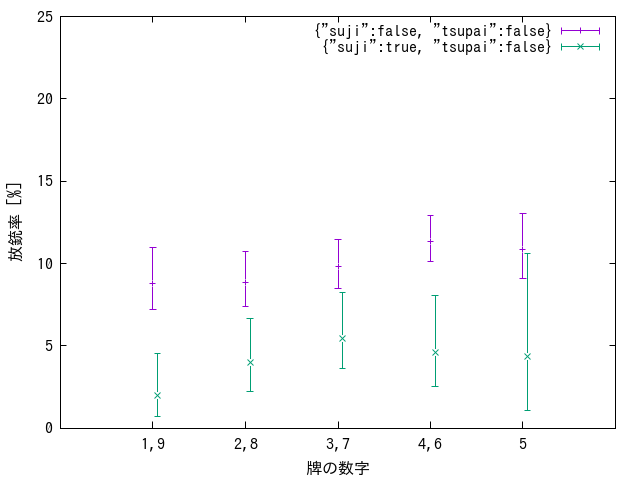

# estimate_danger

This tool analyzes game logs in Mjai format and generates a decision tree to estimate deal-in risk based on game state.

> [!IMPORTANT]
> Unlike the original implementation, this tool only supports the Mjai format.
> `mjlog` format is not supported.

## Subcommands

| Subcommand          | Description                                                                     |
| ------------------- | ------------------------------------------------------------------------------- |
| `extract`           | Extract features from game logs for decision tree learning                      |
| `single`            | Calculate danger probability for a single feature                               |
| `interesting`       | Calculate danger probabilities for predefined interesting feature combinations  |
| `interesting_graph` | Generate graph images and HTML files from `interesting` results                 |
| `benchmark`         | Load feature data and create probability maps in memory for performance testing |
| `tree`              | Generate decision tree model from extracted features and display in text format |
| `dump_tree`         | Display saved decision tree model in text format                                |
| `dump_tree_json`    | Export saved decision tree model to JSON format                                 |

## Basic Usage

With the top-level directory of working tree of this repository as the current directory, run the following command:

```sh
go run ./tools/estimate_danger <SUBCOMMAND> [OPTIONS]... <PATH/TO/INPUT_FILES>
```

## extract

The `extract` command extracts feature vectors from Mjai format game logs and generates training data for decision tree learning.
It focuses specifically on **situations where exactly one player has declared Riichi**, analyzing the safety of each tile discarded by the other players.

### Usage

```sh
go run ./tools/estimate_danger extract -o <OUTPUT_FILEPATH> [OPTIONS]... <PATH/TO/GAME_LOGS>...
```

Arguments

- `<PATH/TO/GAME_LOGS>`  
  Paths to Mjai format game log files to process. Multiple files can be specified.

Required Option

- `-o OUTPUT_FILEPATH`  
  Path to the output file for the extracted feature data (in gob format)

Optional Flags

- `-v`  
  Enable verbose mode (prints feature vectors for each discard candidate to standard output)
- `-filter FILTER_SPEC`  
  Filter extracted scenes by feature conditions and print only matching candidates to standard output.
  - Format: `feature1:1&feature2:0&hit:1`
  - Delimiter: `&`
  - Condition format: `key:value` pairs
  - Value specification: `1` (true) or `0` (false)
  - Available keys:
    - Feature names defined in `Scene` struct (e.g., `suji`, `urasuji`, `visible>=3`, `dora`)
    - Special key `hit` (whether the tile is a winning tile for the Riichi player)
- `-start FILEPATH`  
  Start processing from the specified file
- `-n NUMBER`  
  Limit the number of files to process

### What It Does

- Identifies discard situations after a Riichi declaration by another player; excludes cases with multiple Riichi declarations
- Evaluates feature vectors for each discard candidate
- Determines whether each discard candidate would deal into the Riichi player's hand
- Stores feature vectors and deal-in information in gob format

### Output

The tool outputs a binary gob-encoded file containing:

- Metadata: List of feature names
- Candidate Data: Feature vectors and deal-in information for each discard candidate in each situation

### Example of Usage

```sh
# Basic usage
go run ./tools/estimate_danger extract -o features.gob logs/*.mjson

# Process only the first 100 files in verbose mode
go run ./tools/estimate_danger extract -o features.gob -v -n 100 logs/*.mjson

# Start processing from a specific file
go run ./tools/estimate_danger extract -o features.gob -start logs/game_050.mjson logs/*.mjson

# Specify filter conditions (only filters the standard output display, does not affect data extraction)
go run ./tools/estimate_danger extract -o features.gob -filter "hit:1&suji:0" logs/*.mjson
```

## single

The `single` command calculates individual danger probabilities for each feature from extracted feature data and outputs them with statistical confidence intervals.

### Usage

```sh
go run ./tools/estimate_danger single <PATH/TO/FEATURES_FILE>
```

Arguments

- `<PATH/TO/FEATURES_FILE>`  
  Path to the extracted feature data file (gob format). Specify the file generated by the `extract` command.

### What It Does

- Loads extracted feature data (gob format) and retrieves all feature names
- Calculates danger probabilities for both `true` and `false` conditions for each feature
- Computes confidence intervals and sample counts for each probability
- Outputs results to standard output

### Output

Outputs probability information for each feature to standard output in the following format:

- Feature condition (`map[feature_name:true/false]`)
- Danger probability (percentage)
- Confidence interval (lower bound, upper bound)
- Sample count

### Example of Usage

```sh
go run ./tools/estimate_danger single features.gob
```

### Sample Output

```txt
map[anpai:false]
  9.01 [8.65, 9.75] (545 samples)

map[tsupai:false]
  9.44 [9.06, 10.21] (545 samples)

map[tsupai:true]
  3.07 [2.07, 4.65] (490 samples)

map[suji:false]
  9.64 [9.15, 10.50] (545 samples)

...

map[bakaze:true]
  1.56 [0.00, 4.64] (192 samples)

map[jikaze:false]
  9.08 [8.70, 9.83] (545 samples)

map[jikaze:true]
  0.00 [0.00, 2.11] (188 samples)

```

## interesting

The `interesting` command calculates danger probabilities for predefined interesting feature combinations from extracted feature data and outputs them with statistical confidence intervals.

### Usage

```sh
go run ./tools/estimate_danger interesting [-o <OUTPUT_FILEPATH>] <PATH/TO/FEATURES_FILE>
```

Arguments

- `<PATH/TO/FEATURES_FILE>`  
  Path to the extracted feature data file (gob format). Specify the file generated by the `extract` command.

Optional Flags

- `-o OUTPUT_FILEPATH`  
  Path to the output file for saving the calculated probabilities (in gob format). If not specified, results are only displayed to standard output.

### What It Does

- Loads extracted feature data (gob format) and retrieves all feature names
- Calculates danger probabilities for each interesting criterion combination
- Computes confidence intervals and sample counts for each probability
- Outputs results to standard output and optionally saves to file

### Output

Outputs probability information for each interesting criterion to standard output in the following format:

- Feature combination condition (`map[feature1:value1 feature2:value2 ...]`)
- Danger probability (percentage)
- Confidence interval (lower bound, upper bound)
- Sample count

If `-o` option is specified, also saves the probability data in gob format for use with the `interesting_graph` command.

### Example of Usage

```sh
# Calculate interesting probabilities and display results
go run ./tools/estimate_danger interesting features.gob

# Calculate and save results to file
go run ./tools/estimate_danger interesting -o interesting_probs.gob features.gob
```

### Sample Output

```txt
map[tsupai:true]
  3.07 [2.05, 4.63] (490 samples)

map[sangenpai:true tsupai:true]
  3.13 [1.83, 4.97] (358 samples)

map[sangenpai:false tsupai:true]
  1.95 [1.03, 3.49] (417 samples)

...

map[3<=n<=7:true 4<=n<=6:false same_type_in_prereach>=1:false suji:false tsupai:false]
  13.23 [9.84, 17.58] (185 samples)

map[4<=n<=6:true 5<=n<=5:false same_type_in_prereach>=1:false suji:false tsupai:false]
  11.08 [7.76, 15.41] (185 samples)

map[5<=n<=5:true same_type_in_prereach>=1:false suji:false tsupai:false]
  8.61 [5.50, 13.41] (164 samples)

```

## interesting_graph

The `interesting_graph` command generates probability comparison graphs and HTML visualization files from probability data saved by the `interesting` command.

> [!IMPORTANT]
> This command requires [Gnuplot](http://www.gnuplot.info/) and the [IPAGothic font](https://moji.or.jp/ipafont/) to be installed on the system.

### Usage

```sh
go run ./tools/estimate_danger interesting_graph <PATH/TO/PROBS_FILE>
```

Arguments

- `<PATH/TO/PROBS_FILE>`  
  Path to the probability data file (gob format) generated by the `interesting` command with the `-o` option.

### What It Does

- Loads probability data from the gob-encoded file generated by the `interesting` command
- Generates Gnuplot specifications for probability comparison charts
- Creates data point files for base and test criteria comparisons
- Executes Gnuplot to generate PNG graph images
- Creates an HTML file containing all generated graphs

### Output

Outputs the following files in the `exp/graphs` directory

- Data point files used by Gnuplot (`*.base.points`, `*.test.points`)
- Gnuplot script files (`*.plot`)
- PNG graph files showing probability comparisons (`*.graph.png`)
- An HTML file for viewing all graphs in a web browser (`graphs.html`)

Each graph displays:

- X-axis: Tile numbers (1,9; 2,8; 3,7; 4,6; 5)
- Y-axis: Deal-in rate percentages
- Error bars representing confidence intervals
- Comparison between base and test criteria

### Example of Usage

```sh
go run ./tools/estimate_danger interesting_graph interesting_probs.gob
```

### Sample Output



## benchmark

The `benchmark` command loads extracted feature data and creates probability maps in memory for performance testing purposes.

### Usage

```sh
go run ./tools/estimate_danger benchmark <PATH/TO/FEATURES_FILE>
```

Arguments

- `<PATH/TO/FEATURES_FILE>`  
  Path to the extracted feature data file (gob format). Specify the file generated by the `extract` command.

### What It Does

- Loads extracted feature data (gob format) and retrieves all feature names
- Loads stored kyoku data from the feature data
- Builds predefined interesting criteria combinations
- Creates kyoku probability maps in memory

### Output

Nothing is displayed except progress bars. This command does not generate any output files. It is intended to support performance measurement of data loading and probability map creation using external tools such as `time` or `perf`.

### Example of Usage

```sh
go run ./tools/estimate_danger benchmark features.gob
```

## tree

The `tree` command generates decision trees from extracted feature data using a greedy algorithm that recursively splits features based on confidence interval gaps.

### Usage

```sh
go run ./tools/estimate_danger tree [-o <OUTPUT_FILEPATH>] [-min_gap <PERCENTAGE>] <PATH/TO/FEATURES_FILE>
```

Arguments

- `<PATH/TO/FEATURES_FILE>`  
  Path to the extracted feature data file (gob format). Specify the file generated by the `extract` command.

Optional Flags

- `-o <OUTPUT_FILEPATH>`  
  Path to the output file for saving the generated decision tree (in gob format). If not specified, the tree is only displayed to standard output.

- `-min_gap <PERCENTAGE>`  
  Minimum confidence interval gap percentage required for feature splits (default: 0.0). Higher values create simpler trees by requiring larger statistical differences between branches.

### What It Does

- Loads extracted feature data (gob format) and retrieves all feature names
- Builds a decision tree using a greedy algorithm that recursively selects the best feature splits
  - For each node, evaluates all possible feature splits and calculates confidence interval gaps
  - Selects the feature with the maximum gap above the minimum threshold for splitting
  - Recursively builds child nodes until no feature meets the minimum gap requirement
- Displays the complete tree structure with probabilities and confidence intervals

### Output

Outputs both the decision tree generation process and the incremental tree structure to standard output:

Generation Process Information:

- Debug messages showing the current criterion being processed (`:generate_decision_tree`)
- Feature probability calculations for each criterion combination
- Confidence interval gap calculations for each feature
- Selected feature name for splitting (`:max_name`)

Incremental Tree Structure:

- After each feature split, displays the complete tree structure built so far
- Node probabilities with confidence intervals and sample counts
- Feature splits with true/false branches
- Hierarchical tree structure with indentation showing the decision path

If `-o` option is specified, also saves the final decision tree in gob format for use with `dump_tree` and `dump_tree_json` commands.

### Example of Usage

```sh
# Generate decision tree and display results
go run ./tools/estimate_danger tree features.gob

# Generate tree with minimum gap requirement and save to file
go run ./tools/estimate_danger tree -o decision_tree.gob -min_gap 2.0 features.gob
```

### Sample Output

```txt
:generate_decision_tree, main.Criterion{}
map[]
  9.01 [8.65, 9.74] (545 samples)

map[anpai:false]
  9.01 [8.67, 9.72] (545 samples)

...

"matagisuji", 0.005008593482568255
"senkisuji", -0.016123104870598315
"suji_visible<=3", 0.04216014640822681

...

"suji_in_tehais>=3", 0.00048345349694561834
"+-2_in_prereach_sutehais>=2", 0.010061817156363381
"1_inner_prereach_sutehai", -0.0004900895548952955
:max_name, "jikaze"
all : 9.01 [8.65, 9.74] (545 samples)
  jikaze = true : 0.00 [0.00, 1.58] (188 samples)
  jikaze = false : 9.08 [8.63, 9.84] (545 samples)
:generate_decision_tree, main.Criterion{"jikaze":false}
map[anpai:false jikaze:false]
  9.08 [8.71, 9.84] (545 samples)

...

"visible>=3", -0.01935483870967742
"ryenfonpai", -0.02054794520547945
"dora", -0.02247191011235955
"in_tehais>=2", -0.018404907975460124
"bakaze", -0.02054794520547945
"visible>=1", -0.07317073170731707
"in_tehais>=3", -0.016216216216216217
"visible>=2", -0.02912621359223301
:max_name, ""
all : 9.01 [8.65, 9.74] (545 samples)
  jikaze = true : 0.00 [0.00, 1.58] (188 samples)
  jikaze = false : 9.08 [8.63, 9.84] (545 samples)
    fonpai = true : 2.20 [1.18, 3.89] (380 samples)
    fonpai = false : 9.27 [8.90, 9.98] (545 samples)
      chances<=0 = true : 2.99 [1.87, 4.95] (290 samples)
        suji_visible<=1 = true : 1.07 [0.42, 2.75] (223 samples)
        suji_visible<=1 = false : 6.28 [4.02, 10.19] (197 samples)
      chances<=0 = false : 9.45 [9.03, 10.22] (545 samples)
        sangenpai = true : 3.13 [1.82, 5.06] (358 samples)
        sangenpai = false : 9.66 [9.25, 10.45] (545 samples)
          suji = true : 4.33 [3.27, 5.93] (471 samples)
          suji = false : 10.51 [9.90, 11.39] (545 samples)
            +-2_in_prereach_sutehais>=1 = true : 7.83 [6.98, 9.12] (544 samples)
              reach_suji = true : 0.00 [0.00, 5.00] (58 samples)
              reach_suji = false : 7.95 [7.11, 9.13] (544 samples)
            +-2_in_prereach_sutehais>=1 = false : 13.37 [12.04, 15.15] (514 samples)
              visible>=3 = true : 2.97 [0.76, 7.47] (130 samples)
              visible>=3 = false : 13.53 [12.15, 15.46] (513 samples)
```

## dump_tree

(TODO)

### Usage

```sh
go run ./tools/estimate_danger dump_tree <PATH/TO/INPUT_FILE>
```

### What It Does

(TODO)

### Output

(TODO)

### Example of Usage

(TODO)

### Sample Output

```txt
all : 9.01 [8.64, 9.76] (545 samples)
  jikaze = true : 0.00 [0.00, 1.58] (188 samples)
  jikaze = false : 9.08 [8.70, 9.77] (545 samples)
    fonpai = true : 2.20 [1.17, 3.88] (380 samples)
      dora = false : 1.44 [0.71, 2.91] (376 samples)
      dora = true : 16.67 [7.69, 34.62] (24 samples)
    fonpai = false : 9.27 [8.90, 10.00] (545 samples)
      chances<=0 = true : 2.99 [1.93, 5.05] (290 samples)
      chances<=0 = false : 9.45 [9.06, 10.19] (545 samples)
        fanpai = true : 3.13 [1.80, 5.10] (358 samples)
        fanpai = false : 9.66 [9.25, 10.48] (545 samples)
          suji = true : 4.33 [3.30, 5.96] (471 samples)
          suji = false : 10.51 [9.88, 11.41] (545 samples)
            +-2_in_prereach_sutehais>=1 = true : 7.83 [7.06, 9.07] (544 samples)
              reach_suji = true : 0.00 [0.00, 5.00] (58 samples)
              reach_suji = false : 7.95 [7.13, 9.08] (544 samples)
            +-2_in_prereach_sutehais>=1 = false : 13.37 [11.98, 15.18] (514 samples)
              visible>=3 = true : 2.97 [0.76, 7.25] (130 samples)
              visible>=3 = false : 13.53 [12.11, 15.42] (513 samples)
```

## dump_tree_json

(TODO)

### Usage

```sh
go run ./tools/estimate_danger dump_tree_json -o <OUTPUT_FILEPATH> <PATH/TO/INPUT_FILE>
```

### What It Does

(TODO)

### Output

(TODO)

The output is directly usable as `configs/danger_tree.all.json`.

### Example of Usage

(TODO)

### Sample Output (formatted)

```json
{
    "average_prob": 0.09012803017969008,
    "conf_interval": [
        0.08637499653863692,
        0.097555236551518
    ],
    "num_samples": 545,
    "feature_name": "jikaze",
    "negative": {
        "average_prob": 0.09082334116711277,
        "conf_interval": [
            0.08701252817577079,
            0.09765686765558763
        ],
        "num_samples": 545,
        "feature_name": "fonpai",
        "negative": {
            ...
        },
        "positive": {
            ...
        }
    },
    "positive": {
        "average_prob": 0,
        "conf_interval": [
            0,
            0.015789473684210527
        ],
        "num_samples": 188,
        "feature_name": null,
        "negative": null,
        "positive": null
    }
}
```
